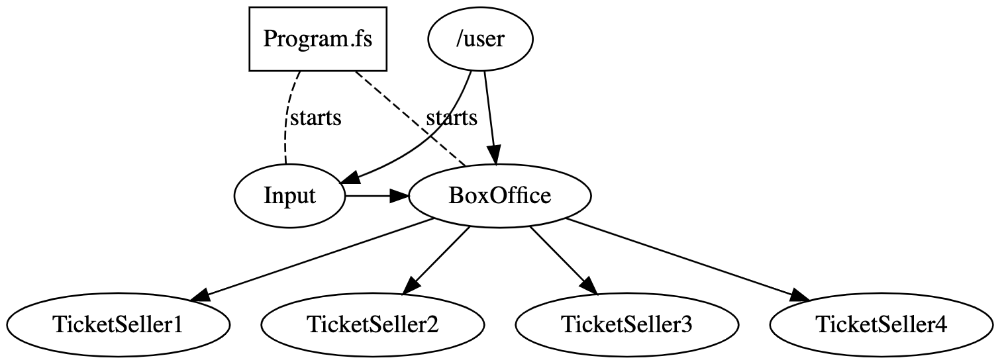
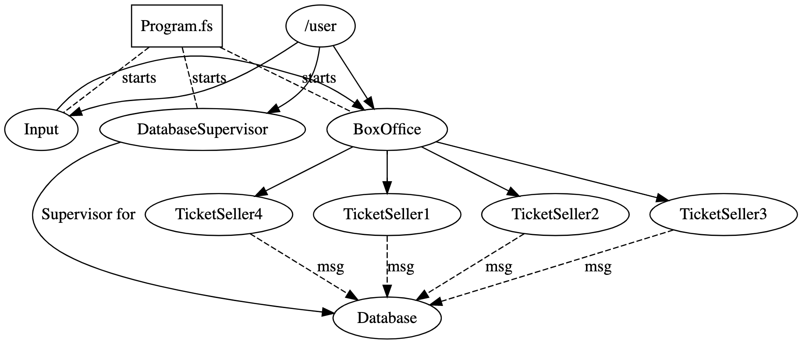

# Assignment 5

In this assignment the goal is to design and implement a "working" Ticket system with Akka.Net

This should properly in a real work application get and save data to a database and properly also have a frontend web API, as interface to the system. Both things will be disregarded in this assignment. So _no_ database and _no_ webapi/frontend. Instead create a simple input Actor (like in the examples from class) than can take commands like

* Buy ticket
* Create event
* etc.

This input Actor should take input from from the 'users' and 'administrators'. 

The overall purpose of the system is to create a ticket system. Where administrators can create events (with tickets) and a user purchase a number of tickets.

----
### Ticket system

Lets create a starting application, which we will enhance a bit later.

We want a system with three actors, `Input` a `BoxOffice` and a `TicketSeller`. The `Input` and `BoxOffice` actor are the only actors we want created from the main method. 

* Every ticket should hold an ID - we don't think of price

#### Description of Actors:

* `TicketSeller` should take the following commands:
    * `Add` with a list of tickets - should add these to any existing tickets. Hint use Actor states (FSM)
    * `Buy` with a number of tickets - should remove `n` tickets from the list. Should give send 1) a list of ticket and 2) the name of the event. Use a type for this.
    * `GetEvent` - Tell sender 1) name and 2) number of available tickets
    * `Cancel` - Should tell the sender about 1) the name and 2) number of available tickets and stop it self. Use `PoisonPill` message and send this to it self

* `BoxOffice` should take the following commands:
    * `CreateEvent` with a name and a number of tickets. This should spawn a `TicketSeller` actor and add `n` tickets to this.
    * `GetTickets` with a name - return available tickets from `TicketSeller` by [forwarding](https://getakka.net/articles/actors/receive-actor-api.html#forward-message).
    * `GetEvent` with a name - [forward](https://getakka.net/articles/actors/receive-actor-api.html#forward-message) message to the correct child - use name or internal dictionary to keep track of children
    * `GetEvents` - [forward](https://getakka.net/articles/actors/receive-actor-api.html#forward-message) to all children about event information.
    * `CancelEvent` with a name - ask the `TickerSeller` to `cancel`
    * `BuyTicket` with a name and number of tickets to buy - should accect/deny the sale.
    
    

----

### Extending our ticket system

We will in this introduce a single Actor which should handle the database communication and since this in a real world application would be something that can fail, we need a supervisor for this. The actors `Database` and `DatabaseSupervisor` should be added to the system.

* `DatabaseSueprvisor` should be made in the main application and should be responsible for creating the `Database` actor and handling errors from this actor. More about these below

* `Database` actor should handle crud information about tickets and events. So imagine this system having to tables

```
Events - (n) --- (1) - Tickets
```
  
So the events being:

* `CreateEvent` with a name
* `CreateTickets` with a list of IDs
* `SellTickets` with a list of IDs - should update status for these tickets.
* `CancelEvent` with a name - should delete Event and tickets in this event.
* `ShowStatus` with a name - this should print the status of all tickets in this event.

The `Database` actor should emulate a database with a Dictionary<Event, Ticket list> which can be updated. And should just use `printfn` to show the writes are handled. The database actor should fail from time to time. Throwing (at random but not to often - every fourth of fifth call) an exception
* IOException - signalling that writing to the database failed - should cause a restart from the Supervisor


Your `TicketSeller` actor should be updated to send messages to your `Database` actor using ActorPath. 


